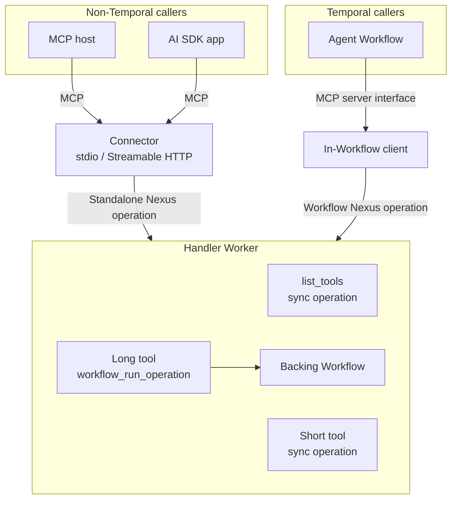
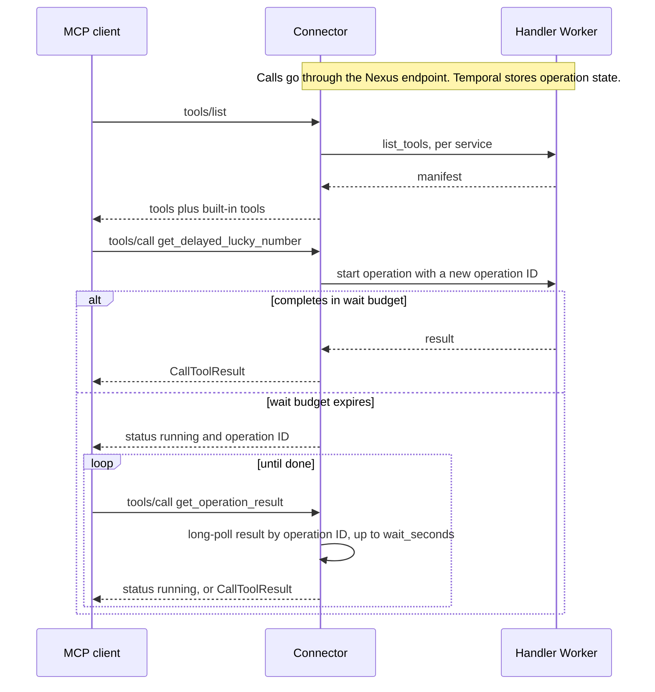
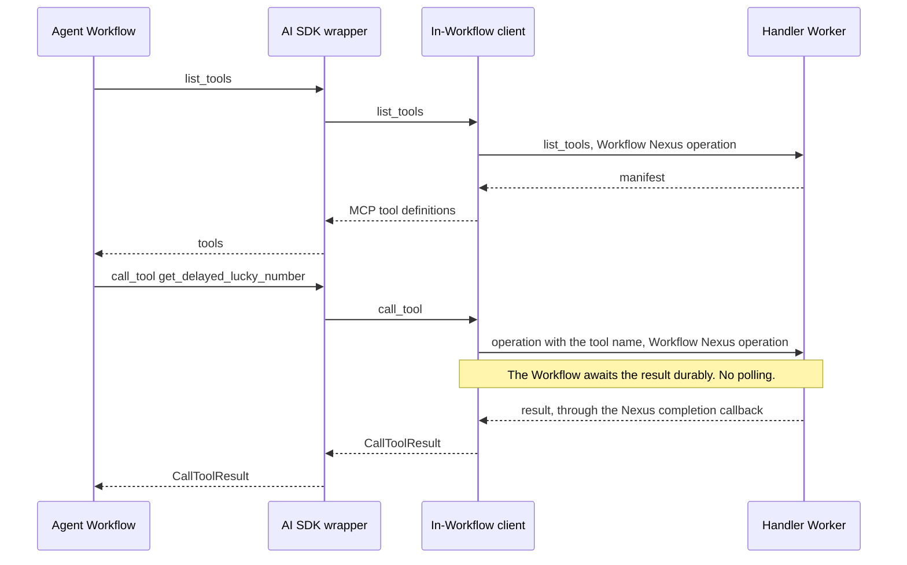
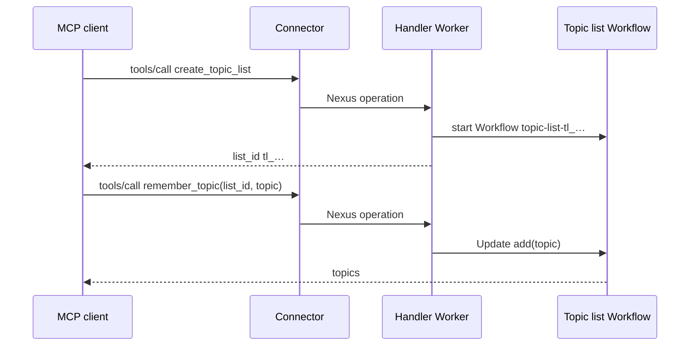
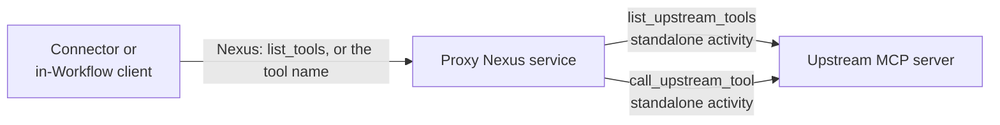

# Architecture

This document describes how the inbound MCP connector maps MCP to Nexus. The MCP
server is a Nexus service. The MCP client can be any caller.

The outbound proxy reuses the inbound path. It is a Nexus service that fronts an
upstream MCP server. See [Outbound proxy](#outbound-proxy).

Scope: stateless MCP, tool discovery, and tool calls for short and long tools.

## Components

Each deliverable serves one caller type.

| Component | Directory | Language | Serves |
|---|---|---|---|
| Connector | `src/connector/` | Go (one binary) | Non-Temporal callers: MCP hosts and AI SDK apps outside a Workflow |
| In-Workflow client | `src/in_workflow_client/python/` | One per SDK language. Python only in this prototype. | Temporal callers: agent Workflows |
| Authoring library | `src/authoring/python/` | One per handler language. Python only in this prototype. | All callers, through the tool manifest |



Features that apply to both caller types go in the authoring library or in the
tool manifest. They do not go in the connector or the in-Workflow client.

## Tool manifest

The authoring library adds a `list_tools` sync operation to each MCP tool service.
The operation returns the manifest for the tool operations:

```json
{
  "tools": [
    {"name": "get_lucky_number", "description": "...", "inputSchema": {"type": "object"}}
  ]
}
```

`tools` holds MCP tool definitions. The library derives the schemas from the
operation input and output types.

A tool with a timeout has `"_meta": {"io.temporal/scheduleToCloseTimeoutMs": <ms>}`. The
connector and the in-Workflow client set it as the schedule-to-close timeout of the
Nexus operation.

Naming rules:

- The tool name is the Nexus operation name. To change a tool name, change the
  operation name.
- The service name is not part of the tool name.
- A tool name must match `^[a-zA-Z0-9_-]{1,64}$`.
- The names `get_operation_result` and `cancel_operation` are reserved for the connector.
- If two configured services expose the same tool name, discovery fails.

The manifest comes from the handler Worker, so it always matches the deployed Worker.
There is no registry.

## Short and long tools

| Kind | Handler form | Result |
|---|---|---|
| Short tool | `@nexus_mcp.tool` above `@nexusrpc.handler.sync_operation` | Returned in the start response |
| Long tool | `@nexus_mcp.tool` above `@temporalio.nexus.workflow_run_operation`. A backing Workflow does the work. | Delivered to Temporal when the backing Workflow completes |

The author writes the Nexus service definition and operations with the nexusrpc
decorators. The MCP decorators do not create operations, models, or Workflows:

- `@nexus_mcp.service`, below `@nexusrpc.service`, adds `list_tools` to the service
  definition.
- `@nexus_mcp.service_handler`, below `@nexusrpc.handler.service_handler`, implements
  `list_tools`. It builds the manifest on the first call, because the handler is
  linked to its definition only after `@nexusrpc.handler.service_handler` runs.
- `@nexus_mcp.tool(...)` marks one operation as a tool. Its `schedule_to_close_timeout`
  bounds each call.
- `@nexus_mcp.service_handler(expose="all")` makes every operation a tool.
  `@nexus_mcp.exclude` keeps one operation out. The default is `expose="marked"`.

`list_tools` is part of the service definition, so non-MCP Nexus callers see it too.

For a long tool, derive the backing Workflow ID from `ctx.request_id`. A retried
Nexus start then reuses the same Workflow.

## Connector path (non-Temporal callers)

The connector uses one flow for short and long tools. It starts a standalone Nexus
operation, then waits for the result up to the wait budget. The wait is a server-side
long-poll. If the budget expires, the connector returns the operation ID. The
operation keeps running in Temporal.

The operation ID is `mcp-<transport>-<mode>-<random>`, for example
`mcp-stdio-stateless-3f2a…` or `mcp-http-stateful-9c1e…`. The random part has 128
bits. The Temporal UI and `temporal nexus operation list` then show which connector
mode started each call.



Built-in tools:

| Tool | Input | Action |
|---|---|---|
| `get_operation_result` | `operation_id`, `wait_seconds` | Long-poll the result, up to `wait_seconds`. The wait budget caps `wait_seconds`. |
| `cancel_operation` | `operation_id` | Request cancellation of the operation |

A `running` result puts the operation ID in the text and in `_meta` under
`io.temporal/operationId`. It has no structured content.

The connector keeps no durable state. After a restart, a client can poll by
operation ID. Any connector replica can serve the poll.

### Output schemas

Through the connector, any tool call can return `running`, and a `running` result has
no structured content. MCP requires structured content when a tool declares an
output schema. So the connector removes `outputSchema` from the tool definitions it
serves. The manifest keeps it, and the in-Workflow client keeps it.

## In-Workflow client path (Temporal callers)

`InWorkflowClient` lists and calls the tools from Workflow code. It does not use the
connector. It has no AI SDK types: `list_tools` returns MCP tool definitions, and
`call_tool` returns an MCP `CallToolResult`. It is not an MCP transport, because it
sends no JSON-RPC.

The agent author wraps the client in the MCP server shape of the AI SDK. The wrapper
only forwards `list_tools` and `call_tool`. `examples/mcp_clients/temporal_agent.py`
has a wrapper for the OpenAI Agents SDK `MCPServer`.



- Each tool call is one Nexus operation in Workflow history.
- The Workflow holds no Worker slot while it waits.
- Workflow cancellation cancels the operation.
- The client needs no wait budget and no built-in tools.

Outside a Workflow, an AI SDK app uses its own stdio MCP client to start the connector.
See `examples/mcp_clients/non_temporal_agent.py`.

## Result mapping

The connector and the in-Workflow client apply the same rules.

| Operation result | MCP result |
|---|---|
| Object | `structuredContent`, plus the same JSON as text |
| String | Text |
| Other value | JSON as text |
| Operation failure | `isError=true` with the failure message |
| Unknown tool | Connector: JSON-RPC `INVALID_PARAMS`. In-Workflow client: `isError=true`. |

## Transport modes

`--stateful` sets the session mode for both transports. The default is stateless.
`--stateful` is legacy. See [Sessions](#sessions).

| | stdio | Streamable HTTP |
|---|---|---|
| Process | The MCP client starts one connector process | Shared service |
| Session, default | None | None. No `Mcp-Session-Id`. |
| Session, `--stateful` | One for the connector process | One per `Mcp-Session-Id`. Ends after 30 idle minutes. |
| Scaling | Not applicable | Default: horizontal, no sticky routing. `--stateful`: sticky routing, because sessions are in process memory. |
| Temporal credentials | From the environment or a `temporal.toml` profile | Same |

## State across calls

The MCP 2026-07-28 spec removes protocol sessions and the `Mcp-Session-Id` header
([SEP-2567](https://modelcontextprotocol.io/seps/2567-sessionless-mcp)). A server
that needs state across calls returns a handle from a create tool. The model passes
the handle as an argument on each later call.

The connector keeps no tool state. A stateful tool keeps its state in Temporal, for
example in one Workflow per handle. The state then survives Worker restarts and works
with more than one Worker. The example tools `create_topic_list` and `remember_topic`
use this pattern:

- `create_topic_list` mints `tl_` plus 128 random bits, and starts one Workflow for
  the list.
- `remember_topic(list_id, topic)` sends a Workflow Update to that Workflow.
- An unknown or expired list returns `NOT_FOUND`.
- The prototype has no auth, so the handle is the only check. Anyone with the handle
  can use the list. SEP-2567 accepts this without auth when the handle has at least
  128 random bits and a bounded lifetime. The list expires after 30 idle minutes.



## Sessions

Sessions are legacy. Clients on MCP 2026-07-28 send no session ID. The MCP Go SDK
serves 2026-07-28 over HTTP only when the transport is stateless, so `--stateful`
HTTP limits clients to older protocol versions.

The connector and the in-Workflow client send the MCP session ID to the handler in the
Nexus header `temporal-mcp-session-id`. A tool reads it with
`nexus_mcp.session_id(ctx)`.

| Caller | Session ID |
|---|---|
| Connector, default (stateless) | None, for stdio and HTTP |
| Connector, `--stateful`, stdio | One ID for the connector process. The MCP client starts one process per session. |
| Connector, `--stateful`, HTTP | The `Mcp-Session-Id` of the session |
| In-Workflow client | The agent Workflow ID, always |

The Go SDK start options for standalone Nexus operations have no header field. The
connector sets the header in a Temporal client interceptor, which can write the
Nexus header of each operation.

## Auth

Auth is out of scope for this prototype. Each component has one stub point:

| Component | Stub point |
|---|---|
| Connector | HTTP mode: act as an OAuth resource server for MCP clients. stdio mode: read credentials from the environment. |
| In-Workflow client | Pass caller identity as Nexus headers (`headers`). No auth logic. |
| Authoring library | Enforce authorization in a handler-side interceptor. Both caller types pass this point. |

With auth, a handler checks each handle against the caller identity on every call, as
SEP-2567 recommends. The MCP Go SDK has `auth.RequireBearerToken` middleware for the
connector side.

The Nexus endpoint's allowed caller namespaces give a namespace-level boundary.

## Limits of the prototype

- Standalone Nexus operations are pre-release. The dev server must enable them.
- Stateful HTTP sessions are in connector memory. A connector restart ends them, and
  more than one replica needs sticky routing.
- The connector sends no end-of-session signal to the handler. Session state ends by
  its own idle timeout.
- The connector does not send `notifications/tools/list_changed`. The MCP Go SDK sends
  it only for tools registered with `AddTool`, and the connector registers none.
- `get_operation_result` and `cancel_operation` accept any operation ID in the caller
  namespace. They do not check that the operation belongs to a configured service.
- Long-running calls use the connector tools `get_operation_result` and
  `cancel_operation`, not the MCP tasks extension (`io.modelcontextprotocol/tasks`).
  The MCP Go SDK rejects unknown methods such as `tasks/get` before the receiving
  middleware runs, and a middleware cannot return a task result from `tools/call`.
  Tasks need support in the SDK, or a JSON-RPC layer below the SDK.
- The connector reads the manifests again on every `tools/list`, and on a
  `tools/call` for an unknown name.
- The connector pins the MCP Go SDK to an unreleased `main` commit. The connector
  answers `tools/list` and `tools/call` in a receiving middleware. Release v1.8.0
  omits the required `resultType` field on such results
  ([go-sdk#1225](https://github.com/modelcontextprotocol/go-sdk/issues/1225)). The fix
  is on `main`. Move to the next tagged release when it is available.
- The outbound proxy depends on nexusrpc internals for its catch-all dispatch. A
  nexusrpc upgrade can break it. `tests/test_proxy.py` detects this.
- The outbound proxy authenticates to the upstream server only with the credentials of
  its client factory. The upstream server cannot see the identity of the MCP caller.
- A `list_tools` call on the proxy calls the upstream server each time. There is no cache.

## Outbound proxy

`nexus_proxy_mcp.MCPProxyPlugin(name, client_factory)` is a Worker plugin. It
registers a Nexus service that fronts one upstream MCP server, and the activities that
call that server. The upstream server knows nothing about Temporal. Callers use the
proxy like any Nexus-backed MCP server, so the connector and the in-Workflow client do
not change.



### Upstream client

- The plugin takes a client factory. The factory returns a new MCP client, as an async
  context manager, for each upstream call. The activity opens the client, makes one
  call, and closes it.
- Upstream credentials live in the factory, in the Worker process. The activity input
  is `{tool, arguments}`. It has no URL and no credentials, so neither enters Temporal
  history.
- A factory, not one shared client, because many activities run at the same time on
  any Worker, and a live connection cannot go in an activity input.
- `http_client_factory(url, headers=..., auth=...)` builds a Streamable HTTP client.
  `auth` takes an `httpx2.Auth`, for example an MCP OAuth provider.
- Each plugin has its own activities. Their names include the service name, for
  example `nexus_proxy_mcp.weather-tools.call_upstream_tool`. More than one plugin can
  run on the same Worker.

### Dispatch

- `list_tools` is a sync operation. It runs the `list_upstream_tools` activity and
  returns the upstream tool list, read live on each call. The proxy drops upstream
  tools with a reserved or invalid name.
- The list activity makes at most 3 attempts. Then `list_tools` fails with a
  non-retryable handler error, so the caller sees an upstream error, such as a
  rejected credential, in a few seconds. It does not wait for the discovery timeout.
- Any other valid tool name is an operation. The proxy has no fixed list of tool
  operations. It forwards the call to the upstream tool with that name.
- An invalid name, or a reserved name (`get_operation_result`, `cancel_operation`),
  returns `NOT_FOUND`.

The Temporal SDKs have no public fallback for an unknown operation name. The proxy
gives nexusrpc a `Mapping` of operations that answers for any valid tool name
(`_CatchAll`). This depends on how nexusrpc looks up operations, and on the private
`nexusrpc.handler._core.ServiceHandler`. `tests/test_proxy.py` checks this behavior.
The same approach does not work in the Go or Java SDKs.

### Tool calls

Every upstream call runs in a standalone activity. The proxy never calls the upstream
server from a Nexus handler.

- Every tool call is an async Nexus operation. The handler starts the activity with the
  Nexus completion callback and returns an operation token. The activity result
  completes the operation.
- `ToolPolicy` holds the activity options. Each field has the name and type of a
  `Client.start_activity` argument, and the proxy passes it to the activity as it is.
  `tool_policy` is the default, and `tool_policy_overrides` sets it for named tools.
- The activity ID uses the Nexus `request_id`, with `USE_EXISTING`. A retried Nexus
  start attaches to the running activity. It does not run the tool two times.
- The default retry policy is one attempt, because a tool can have side effects. Set
  `retry_policy` in an override for a tool that is safe to retry.
- A Nexus cancel request cancels the activity. The activity sees the cancel on its next
  sent heartbeat, so `heartbeat_timeout` (10 seconds by default) sets the delay.
- Tool calls need the server settings `activity.enableCallbacks` and the CHASM
  callback settings. `just temporal` in `examples/` sets them.

### Result mapping

The activity maps the upstream `CallToolResult` to an operation result. Callers then
apply the rules in [Result mapping](#result-mapping).

| Upstream result | Operation result |
|---|---|
| `structuredContent` | The structured content |
| Text content only | The text |
| Non-text content | A placeholder line in the text |
| `isError=true` | Operation failure with the upstream text |

## Future work

- A public fallback handler for unknown operation names in the Nexus SDKs. The proxy
  can then stop depending on nexusrpc internals.
- Non-text upstream content (images, resources) in proxy results.
- MCP Tasks. The operation ID becomes the task ID. `tasks/get` and `tasks/cancel` map to
  describe, result, and cancel on the operation handle. A 2026-07-28 client sends its
  capabilities, including the tasks extension, in the `_meta` of each request. This
  needs task support in the MCP Go SDK first. See [Limits](#limits-of-the-prototype).
- Worker callbacks. The server pushes the completion of a standalone operation to a
  Worker in the caller namespace. The connector can then wait without a long-poll per
  operation.
- In-Workflow clients and authoring libraries for more SDK languages.
