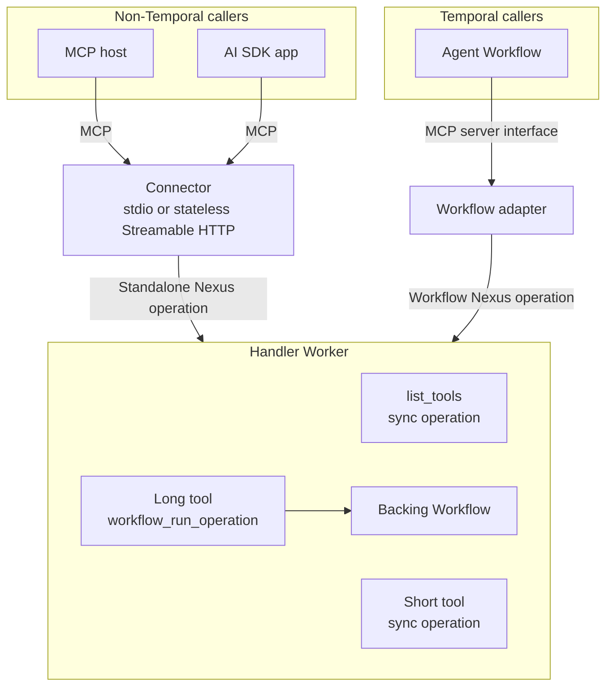
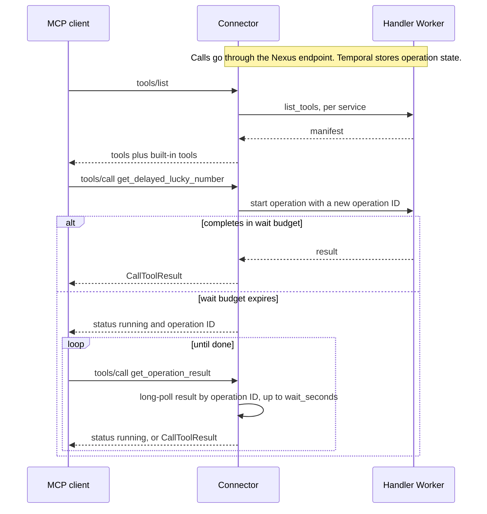
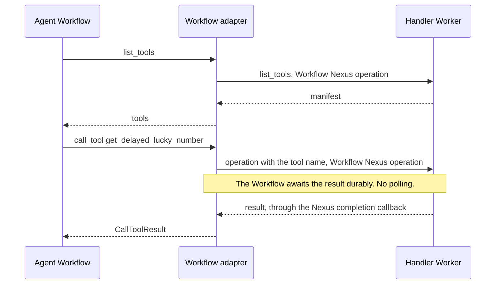
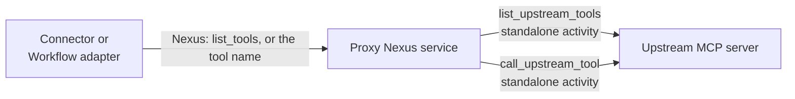

# Architecture

This document describes how the inbound MCP connector maps MCP to Nexus. The MCP
server is a Nexus service. The MCP client can be any caller.

The outbound proxy reuses the inbound path. It is a Nexus service that fronts an
upstream MCP server. See [Outbound proxy](#outbound-proxy).

Scope: stateless MCP, tool discovery, and tool calls for short and long tools.

## Components

Each deliverable serves one caller type.

| Component | Directory | Language | Serves |
|---|---|---|---|
| Connector | `connector/` | Go (one binary) | Non-Temporal callers: MCP hosts and AI SDK apps outside a Workflow |
| Workflow adapter | `adapter/python/` | One per SDK language. Python only in this prototype. | Temporal callers: agent Workflows |
| Authoring library | `authoring/python/` | One per handler language. Python only in this prototype. | All callers, through the tool manifest |



Features that apply to both caller types go in the authoring library or in the
tool manifest. They do not go in the connector or the adapter.

## Tool manifest

The authoring library adds a `list_tools` sync operation to each MCP tool service.
The operation returns the manifest for the operations marked with `@nexus_mcp.tool`:

```json
{
  "tools": [
    {"name": "get_lucky_number", "description": "...", "inputSchema": {"type": "object"}}
  ]
}
```

`tools` holds MCP tool definitions. The library derives the schemas from the
operation input and output types.

Naming rules:

- The tool name is the Nexus operation name. To change a tool name, change the
  operation name.
- The service name is not part of the tool name.
- A tool name must match `^[a-zA-Z0-9_-]{1,64}$`.
- The names `get_operation_result` and `cancel_operation` are reserved for the connector.
- If two configured services expose the same tool name, discovery fails.

The manifest comes from the handler Worker, so it always matches the deployed Worker.
There is no registry.

## Short and long tools

| Kind | Handler form | Result |
|---|---|---|
| Short tool | `@nexus_mcp.tool` above `@nexusrpc.handler.sync_operation` | Returned in the start response |
| Long tool | `@nexus_mcp.tool` above `@temporalio.nexus.workflow_run_operation`. A backing Workflow does the work. | Delivered to Temporal when the backing Workflow completes |

The author writes the Nexus service definition and operations with the nexusrpc
decorators. The MCP decorators do not create operations, models, or Workflows:

- `@nexus_mcp.service`, below `@nexusrpc.service`, adds `list_tools` to the service
  definition.
- `@nexus_mcp.service_handler`, below `@nexusrpc.handler.service_handler`, implements
  `list_tools`. It builds the manifest on the first call, because the handler is
  linked to its definition only after `@nexusrpc.handler.service_handler` runs.
- `@nexus_mcp.tool(...)` marks one operation as a tool.

`list_tools` is part of the service definition, so non-MCP Nexus callers see it too.

For a long tool, derive the backing Workflow ID from `ctx.request_id`. A retried
Nexus start then reuses the same Workflow.

## Connector path (non-Temporal callers)

The connector uses one flow for short and long tools. It starts a standalone Nexus
operation, then waits for the result up to the wait budget. The wait is a server-side
long-poll. If the budget expires, the connector returns the operation ID. The
operation keeps running in Temporal.



Built-in tools:

| Tool | Input | Action |
|---|---|---|
| `get_operation_result` | `operation_id`, `wait_seconds` | Long-poll the result, up to `wait_seconds`. The wait budget caps `wait_seconds`. |
| `cancel_operation` | `operation_id` | Request cancellation of the operation |

A `running` result puts the operation ID in the text and in `_meta` under
`io.temporal/operationId`. It has no structured content.

The connector keeps no durable state. After a restart, a client can poll by
operation ID. Any connector replica can serve the poll.

### Output schemas

Through the connector, any tool call can return `running`, and a `running` result has
no structured content. MCP requires structured content when a tool declares an
output schema. So the connector removes `outputSchema` from the tool definitions it
serves. The manifest keeps it, and the Workflow adapter keeps it.

## Workflow adapter path (Temporal callers)

The adapter implements the OpenAI Agents SDK `MCPServer` interface in Workflow code.
It does not use the connector.



- Each tool call is one Nexus operation in Workflow history.
- The Workflow holds no Worker slot while it waits.
- Workflow cancellation cancels the operation.
- The adapter needs no wait budget and no built-in tools.

`nexus_mcp_server(service, endpoint)` selects the path. In a Workflow, it returns
the adapter. Outside a Workflow, it starts the connector binary over stdio.

## Result mapping

The connector and the adapter apply the same rules.

| Operation result | MCP result |
|---|---|
| Object | `structuredContent`, plus the same JSON as text |
| String | Text |
| Other value | JSON as text |
| Operation failure | `isError=true` with the failure message |
| Unknown tool | Connector: JSON-RPC `INVALID_PARAMS`. Adapter: `isError=true`. |

## Transport modes

| | stdio | Stateless Streamable HTTP |
|---|---|---|
| Process | The MCP client starts one connector process | Shared service |
| Session | One for the process lifetime | None |
| Scaling | Not applicable | Horizontal. No sticky routing. |
| Temporal credentials | From the environment or a `temporal.toml` profile | Same |

## Auth

Auth is out of scope for this prototype. Each component has one stub point:

| Component | Stub point |
|---|---|
| Connector | HTTP mode: act as an OAuth resource server for MCP clients. stdio mode: read credentials from the environment. |
| Workflow adapter | Pass caller identity as Nexus headers (`nexus_headers`). No auth logic. |
| Authoring library | Enforce authorization in a handler-side interceptor. Both caller types pass this point. |

The Nexus endpoint's allowed caller namespaces give a namespace-level boundary.

## Limits of the prototype

- Standalone Nexus operations are pre-release. The dev server must enable them.
- The Go SDK start options for standalone Nexus operations have no Nexus headers, so
  the connector cannot pass caller identity yet.
- `get_operation_result` and `cancel_operation` accept any operation ID in the caller
  namespace. They do not check that the operation belongs to a configured service.
- The connector reads the manifests again on every `tools/list`, and on a
  `tools/call` for an unknown name.
- The connector pins the MCP Go SDK to an unreleased `main` commit. The connector
  answers `tools/list` and `tools/call` in a receiving middleware. Release v1.8.0
  omits the required `resultType` field on such results
  ([go-sdk#1225](https://github.com/modelcontextprotocol/go-sdk/issues/1225)). The fix
  is on `main`. Move to the next tagged release when it is available.
- The outbound proxy depends on nexusrpc internals for its catch-all dispatch. A
  nexusrpc upgrade can break it. `tests/test_proxy.py` detects this.
- The outbound proxy has no auth to the upstream server, and the upstream server
  cannot see the caller identity.
- A `list_tools` call on the proxy calls the upstream server each time. There is no cache.

## Outbound proxy

`nexus_proxy_mcp.mcp_proxy(name, url)` returns a Nexus service that fronts one
upstream MCP server. The upstream server knows nothing about Temporal. Callers use the
proxy like any Nexus-backed MCP server, so the connector and the Workflow adapter do
not change.



### Dispatch

- `list_tools` is a sync operation. It runs `list_upstream_tools` and returns the
  upstream tool list, read live on each call. The proxy drops upstream tools with a
  reserved or invalid name.
- Any other valid tool name is an operation. The proxy has no fixed list of tool
  operations. It forwards the call to the upstream tool with that name.
- An invalid name, or a reserved name (`get_operation_result`, `cancel_operation`),
  returns `NOT_FOUND`.

The Temporal SDKs have no public fallback for an unknown operation name. The proxy
gives nexusrpc a `Mapping` of operations that answers for any valid tool name
(`_CatchAll`). This depends on how nexusrpc looks up operations, and on the private
`nexusrpc.handler._core.ServiceHandler`. `tests/test_proxy.py` checks this behavior.
The same approach does not work in the Go or Java SDKs.

### Sync and async

Every upstream call runs in a standalone activity. The proxy never calls the upstream
server from a Nexus handler. `ToolPolicy` sets how each tool runs:

| Mode | When | Handler |
|---|---|---|
| Sync | `must_async=False` and `max_timeout` is at most the sync limit (5 seconds by default) | Waits for the activity inside the Nexus request. Returns the result. |
| Async (default) | All other cases | Starts the activity with the Nexus completion callback. Returns an operation token. |

- The activity ID uses the Nexus `request_id`, with `USE_EXISTING`. A retried Nexus
  start attaches to the running activity. It does not run the tool two times.
- The default retry policy is one attempt, because a tool can have side effects.
- A Nexus cancel request cancels the activity. The activity sees the cancel on its next
  sent heartbeat, so `heartbeat_timeout` (10 seconds by default) sets the delay.
- The async path needs the server settings `activity.enableCallbacks` and the CHASM
  callback settings. `just temporal` in `examples/` sets them.

### Result mapping

The activity maps the upstream `CallToolResult` to an operation result. Callers then
apply the rules in [Result mapping](#result-mapping).

| Upstream result | Operation result |
|---|---|
| `structuredContent` | The structured content |
| Text content only | The text |
| Non-text content | A placeholder line in the text |
| `isError=true` | Operation failure with the upstream text |

## Future work

- A public fallback handler for unknown operation names in the Nexus SDKs. The proxy
  can then stop depending on nexusrpc internals.
- Non-text upstream content (images, resources) in proxy results.
- MCP Tasks. The operation ID becomes the task ID. `tasks/get`, `tasks/result`, and
  `tasks/cancel` map to describe, result, and cancel on the operation handle.
- Worker callbacks. The server pushes the completion of a standalone operation to a
  Worker in the caller namespace. The connector can then wait without a long-poll per
  operation.
- Workflow adapters and authoring libraries for more SDK languages.
