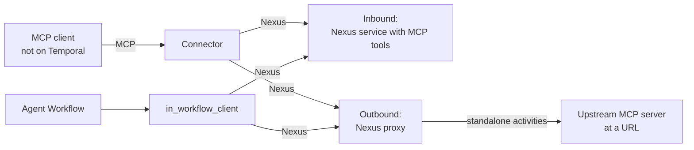

# Durable MCP Connector

MCP connector for Temporal Nexus. The MCP client can be a Temporal Workflow or any
other MCP client.

- Inbound: the MCP server is a Nexus service.
- Outbound: a Nexus proxy fronts an upstream MCP server at a URL. Every upstream call
  runs in a standalone activity.

This repository is a prototype. See [ARCHITECTURE.md](ARCHITECTURE.md) for the design.



Callers use the same connector and in-Workflow client for both. The tool name is the
Nexus operation name in both cases.

## Components

| Directory | Component | Serves |
|---|---|---|
| `src/connector/` | Connector. A Go library and a binary. MCP server over stdio or Streamable HTTP. Keeps nothing between requests. | Non-Temporal callers |
| `src/in_workflow_client/python/` | `in_workflow_client`: calls the tools from Workflow code. No AI SDK types. | Temporal callers |
| `src/authoring/python/` | `nexus_backed_mcp`: exposes Nexus operations as MCP tools. `nexus_proxy_mcp`: fronts an upstream MCP server with a Nexus service. | Tool authors |
| `examples/` | A Nexus-backed MCP server, a Nexus proxy MCP server, non-Temporal callers (OpenAI Agents SDK, Pydantic AI, LangChain, Anthropic SDK, and a deterministic client with the MCP tasks extension), and a Temporal caller | |

## Requirements

- Go 1.26 or later
- Python 3.11 or later and [uv](https://docs.astral.sh/uv/)
- [just](https://github.com/casey/just)
- Temporal CLI 1.9.1 or later. The dev server must enable standalone Nexus operations,
  standalone activities, and activity callbacks. `just temporal` in `examples/` does this.

## Build and test

```sh
uv sync
(cd examples && just build)   # builds bin/durable-mcp-connector
(cd tests && just test)       # Go and Python unit tests
```

## Inbound: author a tool service

Keep the nexusrpc decorators. Add the MCP decorators below them.

```python
from datetime import timedelta

import nexus_backed_mcp as nexus_mcp
import nexusrpc
import nexusrpc.handler
import temporalio.nexus


@nexusrpc.service(name="my-tools")
@nexus_mcp.service                      # declares list_tools
class MyService:
    lookup: nexusrpc.Operation[LookupInput, str]
    run_report: nexusrpc.Operation[ReportInput, Report]


@nexusrpc.handler.service_handler(service=MyService)
@nexus_mcp.service_handler              # implements list_tools
class MyTools:
    @nexus_mcp.tool(title="Look up a key")
    @nexusrpc.handler.sync_operation
    async def lookup(self, ctx, input: LookupInput) -> str:
        """Short tool. A sync Nexus operation."""
        ...

    @nexus_mcp.tool(title="Run a report", schedule_to_close_timeout=timedelta(minutes=30))
    @temporalio.nexus.workflow_run_operation
    async def run_report(self, ctx, input: ReportInput) -> temporalio.nexus.WorkflowHandle[Report]:
        """Long tool. ReportWorkflow does the work."""
        return await ctx.start_workflow(ReportWorkflow.run, input, id=f"report-{ctx.request_id}")
```

| Decorator | Put it | Does |
|---|---|---|
| `@nexus_mcp.service` | Below `@nexusrpc.service` | Adds the `list_tools` operation to the service definition |
| `@nexus_mcp.service_handler` | Below `@nexusrpc.handler.service_handler` | Adds the `list_tools` implementation to the handler |
| `@nexus_mcp.tool(...)` | Above a sync or async Nexus operation decorator | Marks the operation as a tool. Sets title, annotations, metadata, and `schedule_to_close_timeout`. |
| `@nexus_mcp.exclude` | Above a Nexus operation decorator | Keeps the operation out of the tools of an `expose="all"` handler |

Tools are opt-in by default. An operation without `@nexus_mcp.tool` is not a tool. With
`@nexus_mcp.service_handler(expose="all")`, every operation is a tool, except those with
`@nexus_mcp.exclude`. The tool name is the Nexus operation name. The description
defaults to the method docstring.

`schedule_to_close_timeout` bounds each call of the tool. The connector and the
in-Workflow client set it on the Nexus operation.

## Outbound: front an upstream MCP server

`MCPProxyPlugin(name, client_factory)` is a Worker plugin. It registers a Nexus
service named `name` and the activities that call the upstream server. The upstream
server needs no change.

```python
from datetime import timedelta

from nexus_proxy_mcp import MCPProxyPlugin, ToolPolicy, http_client_factory
from temporalio.common import RetryPolicy

proxy = MCPProxyPlugin(
    "weather-tools",
    http_client_factory("https://mcp.example.com/mcp", headers={"Authorization": f"Bearer {token}"}),
    tool_policy_overrides={
        "get_weather": ToolPolicy(start_to_close_timeout=timedelta(seconds=3)),
        "get_forecast_report": ToolPolicy(retry_policy=RetryPolicy(maximum_attempts=3)),
    },
)
worker = Worker(client, task_queue="weather-proxy", plugins=[proxy])
```

- `client_factory` returns a new MCP client for each upstream call. Upstream
  credentials go there, so they stay in the Worker process. Activity inputs and
  results do not carry them. `http_client_factory(url, headers=..., auth=...)` covers
  Streamable HTTP with headers or an `httpx2.Auth`, for example an MCP OAuth provider.
- `ToolPolicy` holds the activity options: `start_to_close_timeout`,
  `schedule_to_close_timeout`, `schedule_to_start_timeout`, `heartbeat_timeout`, and
  `retry_policy`. They have the names and types of `Client.start_activity`, and the
  proxy passes them to the activity as they are. `tool_policy` sets the default.
  `tool_policy_overrides` sets the policy for named tools.
- If no policy sets `retry_policy`, the proxy infers it from the MCP tool annotations of
  the upstream tool. A tool that says it is destructive and not idempotent gets one
  attempt. All other tools get 5 attempts. The proxy caches the annotations from the
  upstream tool list. It fills the cache at Worker start, on each `list_tools`, and on
  a call to a tool that is not in the cache. To turn off inference for all tools, set
  `tool_policy=ToolPolicy(retry_policy=...)`.
- The proxy service has two fixed operations. `list_tools` returns the upstream tool
  list, read live on each call. Its manifest has `dispatch`, so callers send every
  tool call to `call_tool` with `{"name": <tool>, "arguments": ...}`. A new upstream
  tool needs no Worker restart.
- Every tool call is an async Nexus operation. It runs in a standalone activity, and
  shows in `temporal activity list`.

Limits:

- The upstream server cannot see the identity of the MCP caller. It sees only the
  credentials of the client factory.
- Non-text upstream content (images, resources) becomes a placeholder line.

See [ARCHITECTURE.md](ARCHITECTURE.md#outbound-proxy).

## Call the tools

From Workflow code, use `InWorkflowClient`. It returns MCP tool definitions and MCP tool
results:

```python
from in_workflow_client import InWorkflowClient

client = InWorkflowClient({"my-tools": "my-tools-endpoint"})
tools = await client.list_tools()
result = await client.call_tool("lookup", {"key": "a"})
```

To give the tools to an AI SDK agent, wrap the client in the MCP server shape of that
SDK. [`examples/mcp_clients/temporal_agent.py`](examples/mcp_clients/temporal_agent.py)
has a wrapper for the OpenAI Agents SDK.

From any MCP host, add the connector as a stdio MCP server:

```json
{
  "mcpServers": {
    "my-tools": {
      "command": "durable-mcp-connector",
      "args": ["--service", "my-tools=my-tools-endpoint"],
      "env": {"TEMPORAL_ADDRESS": "localhost:7233", "TEMPORAL_NAMESPACE": "default"}
    }
  }
}
```

## Connector flags

| Flag | Default | Meaning |
|---|---|---|
| `--service SERVICE=ENDPOINT` | none | Nexus service and endpoint. Repeat for more services. |
| `--transport` | `stdio` | `stdio` or `http` (Streamable HTTP) |
| `--addr` | `127.0.0.1:8080` | Listen address for `http` |
| `--wait-budget` | `0` (no limit) | Longest time a tool call waits for a result, for a client without the MCP tasks extension. After it, the call returns an error result with the operation ID, and the operation keeps running. A client with the extension gets a task after about 2 seconds instead. |
| `--codec-endpoint` | none | URL of a remote codec server. Set it when the Nexus handler encodes payloads, for example to encrypt them. The codec must match the codec of the handler. |

The connector reads Temporal connection settings from the environment and from a
`temporal.toml` profile: `TEMPORAL_ADDRESS`, `TEMPORAL_NAMESPACE`, `TEMPORAL_PROFILE`,
`TEMPORAL_CONFIG_FILE`, and related variables. Set the caller namespace with
`TEMPORAL_NAMESPACE`.

## Use the connector as a Go library

The packages `resolver`, `sano`, and `server` in `src/connector/` are public. Build the
Temporal client yourself, so you control credentials, namespace, and the data converter.
Then serve the MCP server with your own transport and middleware, for example auth. See
[`server/example_test.go`](src/connector/server/example_test.go).

## Examples

See [examples](examples/README.md).
