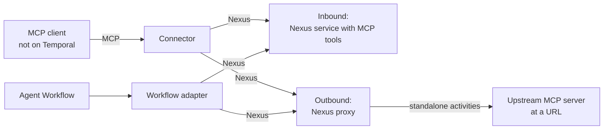

# Durable MCP Connector

MCP connector for Temporal Nexus. The MCP client can be a Temporal Workflow or any
other MCP client.

- Inbound: the MCP server is a Nexus service.
- Outbound: a Nexus proxy fronts an upstream MCP server at a URL. Every upstream call
  runs in a standalone activity.

This repository is a prototype. See [ARCHITECTURE.md](ARCHITECTURE.md) for the design.



Callers use the same connector and Workflow adapter for both. The tool name is the
Nexus operation name in both cases.

## Components

| Directory | Component | Serves |
|---|---|---|
| `connector/` | Connector. A Go binary. MCP server over stdio or stateless Streamable HTTP. | Non-Temporal callers |
| `adapter/python/` | Workflow adapter for the OpenAI Agents SDK, and the `nexus_mcp_server` helper | Temporal callers |
| `authoring/python/` | `nexus_backed_mcp`: exposes Nexus operations as MCP tools. `nexus_proxy_mcp`: fronts an upstream MCP server with a Nexus service. | Tool authors |
| `examples/` | A Nexus-backed MCP server, a Nexus proxy MCP server, a non-Temporal caller, and a Temporal caller | |

## Requirements

- Go 1.26 or later
- Python 3.11 or later and [uv](https://docs.astral.sh/uv/)
- [just](https://github.com/casey/just)
- Temporal CLI 1.9.1 or later. The dev server must enable standalone Nexus operations,
  standalone activities, and activity callbacks. `just temporal` in `examples/` does this.

## Build and test

```sh
uv sync
(cd examples && just build)   # builds bin/durable-mcp-connector
(cd tests && just test)       # Go and Python unit tests
```

## Inbound: author a tool service

Keep the nexusrpc decorators. Add the MCP decorators below them.

```python
import nexus_backed_mcp as nexus_mcp
import nexusrpc
import nexusrpc.handler
import temporalio.nexus


@nexusrpc.service(name="my-tools")
@nexus_mcp.service                      # declares list_tools
class MyService:
    lookup: nexusrpc.Operation[LookupInput, str]
    run_report: nexusrpc.Operation[ReportInput, Report]


@nexusrpc.handler.service_handler(service=MyService)
@nexus_mcp.service_handler              # implements list_tools
class MyTools:
    @nexus_mcp.tool(title="Look up a key")
    @nexusrpc.handler.sync_operation
    async def lookup(self, ctx, input: LookupInput) -> str:
        """Short tool. A sync Nexus operation."""
        ...

    @nexus_mcp.tool(title="Run a report")
    @temporalio.nexus.workflow_run_operation
    async def run_report(self, ctx, input: ReportInput) -> temporalio.nexus.WorkflowHandle[Report]:
        """Long tool. ReportWorkflow does the work."""
        return await ctx.start_workflow(ReportWorkflow.run, input, id=f"report-{ctx.request_id}")
```

| Decorator | Put it | Does |
|---|---|---|
| `@nexus_mcp.service` | Below `@nexusrpc.service` | Adds the `list_tools` operation to the service definition |
| `@nexus_mcp.service_handler` | Below `@nexusrpc.handler.service_handler` | Adds the `list_tools` implementation to the handler |
| `@nexus_mcp.tool(...)` | Above a sync or async Nexus operation decorator | Marks the operation as a tool. Sets title, annotations, and metadata. |

Tools are opt-in. An operation without `@nexus_mcp.tool` is not a tool. The tool name
is the Nexus operation name. The description defaults to the method docstring.

## Outbound: front an upstream MCP server

`mcp_proxy(name, url)` returns a Nexus service handler for the MCP server at `url`.
The upstream server needs no change. Register the handler with `PROXY_ACTIVITIES`:

```python
from datetime import timedelta

from nexus_proxy_mcp import PROXY_ACTIVITIES, ToolPolicy, mcp_proxy

proxy = mcp_proxy(
    "weather-tools",
    "https://mcp.example.com/mcp",
    tool_policy_overrides={
        "get_weather": ToolPolicy(must_async=False, max_timeout=timedelta(seconds=3)),
    },
)
worker = Worker(client, task_queue="weather-proxy",
                activities=list(PROXY_ACTIVITIES), nexus_service_handlers=[proxy])
```

- `list_tools` returns the upstream tool list, read live on each call.
- Any other operation name is an upstream tool name. The proxy forwards the call.
- Each tool runs async by default. Set `must_async=False` for a fast tool to run it sync.
- Every upstream call runs in a standalone activity, in sync and async mode. Each call
  shows in `temporal activity list`.

Limits:

- Python only. The proxy accepts any tool name through nexusrpc internals. A nexusrpc
  upgrade can break this. `tests/test_proxy.py` checks it.
- No auth to the upstream server.
- Non-text upstream content (images, resources) becomes a placeholder line.

See [ARCHITECTURE.md](ARCHITECTURE.md#outbound-proxy).

## Call the tools

From an OpenAI Agents SDK agent, in a Workflow or outside one:

```python
from agents import Agent
from durable_mcp_adapter import nexus_mcp_server

agent = Agent(name="agent", mcp_servers=[nexus_mcp_server("my-tools", "my-tools-endpoint")])
```

From any MCP host, add the connector as a stdio MCP server:

```json
{
  "mcpServers": {
    "my-tools": {
      "command": "durable-mcp-connector",
      "args": ["--service", "my-tools=my-tools-endpoint"],
      "env": {"TEMPORAL_ADDRESS": "localhost:7233", "TEMPORAL_NAMESPACE": "default"}
    }
  }
}
```

## Connector flags

| Flag | Default | Meaning |
|---|---|---|
| `--service SERVICE=ENDPOINT` | none | Nexus service and endpoint. Repeat for more services. |
| `--transport` | `stdio` | `stdio` or `http` (stateless Streamable HTTP) |
| `--addr` | `127.0.0.1:8080` | Listen address for `http` |
| `--wait-budget` | `30s` | Longest time a tool call waits for a result before it returns `running` |

The connector reads Temporal connection settings from the environment and from a
`temporal.toml` profile: `TEMPORAL_ADDRESS`, `TEMPORAL_NAMESPACE`, `TEMPORAL_PROFILE`,
`TEMPORAL_CONFIG_FILE`, and related variables.

## Examples

See [examples](examples/README.md).
