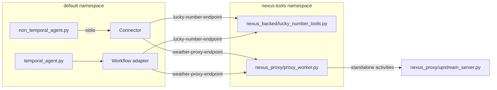
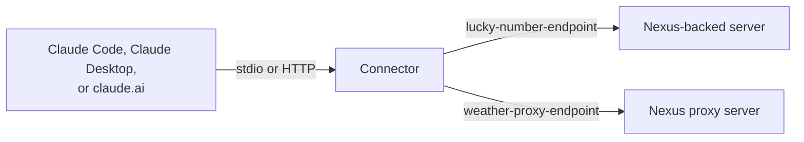

# Examples

Two MCP servers and two MCP clients. Both clients use both servers.

```
examples/
├── mcp_servers/
│   ├── nexus_backed/
│   │   └── lucky_number_tools.py    Nexus service, backing Workflow, and Worker
│   └── nexus_proxy/
│       ├── proxy_worker.py          mcp_proxy(...) Worker in front of the upstream server
│       └── upstream_server.py       Upstream MCP server. It knows nothing about Temporal.
└── mcp_clients/
    ├── non_temporal_agent.py        OpenAI Agents SDK agent. Uses the connector.
    ├── temporal_agent.py            Agent Harness agent Workflow and its Worker
    ├── servers.py                   Service and endpoint of each server
    └── agents.toml                  Agent list for the harness UI
```

Tools:

| Server | Tool | Kind | Behavior |
|---|---|---|---|
| Nexus-backed | `get_lucky_number` | Short. Sync Nexus operation. | Returns at once |
| Nexus-backed | `get_delayed_lucky_number` | Long. Workflow-backed Nexus operation. | Waits on a durable timer, 45 seconds by default |
| Nexus proxy | `get_weather` | Sync by policy: `must_async=False`, `max_timeout=3s` | Returns at once |
| Nexus proxy | `get_forecast_report` | Async by default policy | Sleeps for `seconds`, 45 by default |



The long tools take 45 seconds by default. That is longer than the connector's default
wait budget (30 seconds). A non-Temporal call to a long tool therefore returns
`running` first. The agent then calls `get_operation_result`. The Temporal client
awaits the result durably and does not poll.

Each proxy call to the upstream server is a standalone activity in the `nexus-tools`
namespace. To see them, run `temporal activity list -n nexus-tools`. The activity ID
is `mcp-<service>-<tool>-<request id>`.

## Run

Copy `.env.example` to `.env` in the repository root and set `OPENAI_API_KEY`.

Run each command from this `examples/` directory, in a separate terminal, in this order.
Run `just` to list all recipes.

```sh
just temporal         # 1. dev server with standalone operations and activity callbacks
just setup            # 2. once per dev server: create both Nexus endpoints
just nexus-backed     # 3. the Nexus-backed MCP server Worker
just upstream         # 4. the upstream MCP server
just nexus-proxy      # 5. the Nexus proxy MCP server Worker
```

The clients use both servers. Start all of them first. If one server does not run,
tool discovery fails.

Non-Temporal client:

```sh
just non-temporal-agent "What is my delayed lucky number? My name is Ada. And what is the weather in Lisbon?"
```

Temporal client:

```sh
just agent-worker     # the agent Worker
just session-manager  # the harness session manager
just ui               # the harness UI on http://localhost:8000
```

Open the UI, select **Nexus MCP tools**, and start a chat.

## Connect Claude

Any MCP host can use the connector. This section shows Claude Code, Claude Desktop,
and claude.ai.

First, run steps 1 to 5 of [Run](#run), and build the connector:

```sh
just build     # creates bin/durable-mcp-connector at the repository root
```

The examples use `/path/to/durable-mcp-connector` for the repository path. Use the
absolute path, because the host starts the connector from its own working directory.

`TEMPORAL_NAMESPACE=default` is the caller namespace. The endpoints route the calls
to the `nexus-tools` namespace.



### Claude Code over stdio

Claude Code starts the connector as a child process.

```sh
claude mcp add nexus-tools \
  -e TEMPORAL_ADDRESS=localhost:7233 \
  -e TEMPORAL_NAMESPACE=default \
  -- /path/to/durable-mcp-connector/bin/durable-mcp-connector \
     --service lucky-number-tools=lucky-number-endpoint \
     --service weather-tools=weather-proxy-endpoint
```

Add `-s project` to write the entry to `.mcp.json` in the current project.

### Claude Code over HTTP on localhost

Start the connector, then add its URL:

```sh
just connector-http                                 # serves http://127.0.0.1:8080
claude mcp add --transport http nexus-tools http://127.0.0.1:8080
```

### Claude Desktop over stdio

Add the connector to `claude_desktop_config.json`. On macOS the file is at
`~/Library/Application Support/Claude/claude_desktop_config.json`.

```json
{
  "mcpServers": {
    "nexus-tools": {
      "command": "/path/to/durable-mcp-connector/bin/durable-mcp-connector",
      "args": [
        "--service", "lucky-number-tools=lucky-number-endpoint",
        "--service", "weather-tools=weather-proxy-endpoint"
      ],
      "env": {"TEMPORAL_ADDRESS": "localhost:7233", "TEMPORAL_NAMESPACE": "default"}
    }
  }
}
```

Restart Claude Desktop after you change the file.

### claude.ai

claude.ai connects to custom connectors from Anthropic's servers, so it cannot reach
`localhost`. It needs a public HTTPS URL:

1. Run `just connector-http`.
2. Expose `127.0.0.1:8080` through an HTTPS tunnel.
3. In claude.ai, add a custom connector with the tunnel URL.

The connector has no auth. Anyone with the tunnel URL can call the tools. Use this
only for a short test, and stop the tunnel after the test.

### Check the connection

- In Claude Code, run `/mcp`. The `nexus-tools` server shows six tools:
  `get_lucky_number`, `get_delayed_lucky_number`, `get_weather`,
  `get_forecast_report`, `get_operation_result`, and `cancel_operation`.
- Ask: "What is my delayed lucky number? My name is Ada."
- The long tools take 5 seconds by default. The connector waits up to 30 seconds,
  then returns status `running` with an operation ID. Claude then calls
  `get_operation_result` with that ID.
- To get the result in the first call, add `--wait-budget 60s` to the connector
  arguments, or ask for a shorter delay.
- If the host times out a tool call before the connector returns, set a shorter
  `--wait-budget`.
