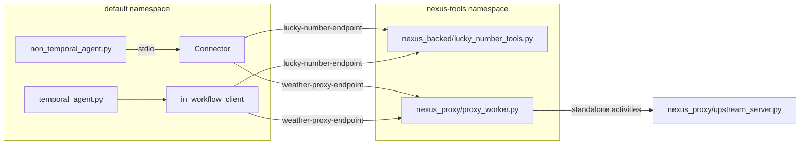
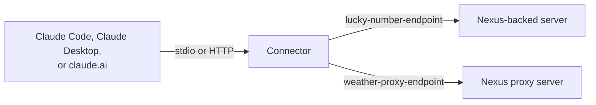

# Examples

Two MCP servers and six MCP clients. All clients except `task_compatible_agent.py` use both servers.

```
examples/
├── mcp_servers/
│   ├── nexus_backed/
│   │   └── lucky_number_tools.py    Nexus service, backing Workflow, and Worker
│   └── nexus_proxy/
│       ├── proxy_worker.py          Worker with MCPProxyPlugin in front of the upstream server
│       └── upstream_server.py       Upstream MCP server. Requires a bearer token. Knows nothing about Temporal.
└── mcp_clients/
    ├── non_temporal_agent.py        OpenAI Agents SDK agent. Uses the connector.
    ├── pydantic_ai_agent.py         Pydantic AI agent. Uses the connector. Own dependencies.
    ├── langchain_agent.py           LangChain agent. Uses the connector. Own dependencies.
    ├── anthropic_agent.py           Claude agent (Anthropic SDK). Uses the connector. Own dependencies.
    ├── task_compatible_agent.py     Deterministic client with the MCP tasks extension. No LLM. Uses the connector.
    ├── temporal_agent.py            Agent Harness agent Workflow and its Worker
    ├── servers.py                   Service and endpoint of each server
    └── agents.toml                  Agent list for the harness UI
```

Tools:

| Server | Tool | Kind | Behavior |
|---|---|---|---|
| Nexus-backed | `get_lucky_number` | Short. Sync Nexus operation. | Returns at once |
| Nexus-backed | `get_delayed_lucky_number` | Long. Workflow-backed Nexus operation. | Waits on a durable timer, 5 seconds by default |
| Nexus-backed | `create_topic_list` | Handle. Sync Nexus operation. | Returns a `list_id` handle and starts one Workflow for the list. The list expires after 30 idle minutes. |
| Nexus-backed | `remember_topic` | Handle. Sync Nexus operation. | Adds a topic to the list `list_id` and returns all topics. |
| Nexus proxy | `get_weather` | Async. Override: `start_to_close_timeout=3s`. Retry inferred from `readOnlyHint=true`: 5 attempts. | Returns at once |
| Nexus proxy | `get_forecast_report` | Async. Override: up to 3 attempts. The override wins over inference. | Sleeps for `seconds`, 45 by default |
| Nexus proxy | `delete_station` | Async. Annotated `destructiveHint=true` and `idempotentHint=true`. Retry inferred: 5 attempts. | Removes a station from an in-memory list |



The long tools take 45 seconds by default. A non-Temporal call to a long tool waits
for the result in one call, because the connector's wait budget has no limit by
default. A client with the MCP tasks extension gets a task instead and polls
`tasks/get`. The Temporal client awaits the result durably and does not poll.

Each proxy call to the upstream server is a standalone activity in the `nexus-tools`
namespace. To see them, run `temporal activity list -n nexus-tools`. The activity ID
is `mcp-<service>-<tool>-<request id>`.

The upstream server requires a bearer token. The proxy Worker sends it through its
client factory, `http_client_factory(url, headers=...)`. The token stays in the proxy
Worker process. Activity inputs and results do not carry it. Both processes read
`UPSTREAM_MCP_TOKEN`, with the same default value, so the example runs with no setup.

## Run

Copy `.env.example` to `.env` in the repository root and set `OPENAI_API_KEY`.

Run each command from this `examples/` directory, in a separate terminal, in this order.
Run `just` to list all recipes.

```sh
just temporal         # 1. dev server with standalone operations and activity callbacks
just setup            # 2. once per dev server: create both Nexus endpoints
just nexus-backed     # 3. the Nexus-backed MCP server Worker
just upstream         # 4. the upstream MCP server
just nexus-proxy      # 5. the Nexus proxy MCP server Worker
```

The clients use both servers. Start all of them first. If one server does not run,
tool discovery fails.

Non-Temporal client:

```sh
just non-temporal-agent "What is my delayed lucky number? My name is Ada. And what is the weather in Lisbon?"
```

The same agent with other AI SDKs. Each script has its own dependencies in inline
script metadata, so `uv run --script` makes a separate environment for it:

```sh
just pydantic-ai-agent "What is my lucky number? My name is Ada."
just langchain-agent "What is my lucky number? My name is Ada."
just anthropic-agent "What is my lucky number? My name is Ada."
```

A deterministic client with the MCP tasks extension. It needs no LLM and no API key,
and it uses only the Nexus-backed server. It starts the connector with a 3-second wait
budget, so the long tool returns a task. The client polls `tasks/get`, then cancels a
second task with `tasks/cancel`:

```sh
just task-compatible-agent
```

Temporal client:

```sh
just agent-worker     # the agent Worker
just session-manager  # the harness session manager
just ui               # the harness UI on http://localhost:8000
```

Open the UI, select **Nexus MCP tools**, and start a chat.

## Connect Claude

Any MCP host can use the connector. This section shows Claude Code, Claude Desktop,
and claude.ai.

First, run steps 1 to 5 of [Run](#run), and build the connector:

```sh
just build     # creates bin/durable-mcp-connector at the repository root
```

The examples use `/path/to/durable-mcp-connector` for the repository path. Use the
absolute path, because the host starts the connector from its own working directory.

`TEMPORAL_NAMESPACE=default` is the caller namespace. The endpoints route the calls
to the `nexus-tools` namespace.



### Claude Code over stdio

Claude Code starts the connector as a child process.

```sh
claude mcp add nexus-tools \
  -e TEMPORAL_ADDRESS=localhost:7233 \
  -e TEMPORAL_NAMESPACE=default \
  -- /path/to/durable-mcp-connector/bin/durable-mcp-connector \
     --service lucky-number-tools=lucky-number-endpoint \
     --service weather-tools=weather-proxy-endpoint
```

Add `-s project` to write the entry to `.mcp.json` in the current project.

### Claude Code over HTTP on localhost

Start the connector, then add its URL:

```sh
just connector-http                                 # serves http://127.0.0.1:8080
claude mcp add --transport http nexus-tools http://127.0.0.1:8080
```

### Claude Desktop over stdio

Add the connector to `claude_desktop_config.json`. On macOS the file is at
`~/Library/Application Support/Claude/claude_desktop_config.json`.

```json
{
  "mcpServers": {
    "nexus-tools": {
      "command": "/path/to/durable-mcp-connector/bin/durable-mcp-connector",
      "args": [
        "--service", "lucky-number-tools=lucky-number-endpoint",
        "--service", "weather-tools=weather-proxy-endpoint"
      ],
      "env": {"TEMPORAL_ADDRESS": "localhost:7233", "TEMPORAL_NAMESPACE": "default"}
    }
  }
}
```

Restart Claude Desktop after you change the file.

### claude.ai over an ngrok tunnel

claude.ai connects to custom connectors from Anthropic's servers, so it cannot reach
`localhost`. It needs a public HTTPS URL. This example uses ngrok.

1. Start the connector over HTTP:

   ```sh
   just connector-http
   ```

2. In another terminal, open the tunnel:

   ```sh
   ngrok http 8080 --host-header=rewrite
   ```

   The connector rejects a request with status 403 if the request arrives on a
   localhost address and its `Host` header is not a localhost name. This is the DNS
   rebinding protection of the MCP Go SDK. `--host-header=rewrite` sets `Host` to
   `localhost:8080`. ngrok 3.39 marks this flag as deprecated but still accepts it.
   The traffic policy form is below.

3. Copy the `Forwarding` URL from the ngrok output, for example
   `https://abc123.ngrok-free.app`.

4. Check the tunnel. The response must be status 200:

   ```sh
   curl -s -o /dev/null -w '%{http_code}\n' -X POST https://abc123.ngrok-free.app/ \
     -H 'Content-Type: application/json' -H 'Accept: application/json, text/event-stream' \
     -d '{"jsonrpc":"2.0","id":1,"method":"initialize","params":{"protocolVersion":"2025-06-18","capabilities":{},"clientInfo":{"name":"curl","version":"0"}}}'
   ```

5. In claude.ai, add a custom connector with the `Forwarding` URL.

6. To stop, press Ctrl+C in the ngrok terminal.

Other ngrok commands:

```sh
# Keep the same URL across restarts. Use a domain from your ngrok account.
ngrok http 8080 --host-header=rewrite --url https://your-name.ngrok.app

# Rewrite the Host header with a traffic policy instead of the deprecated flag.
cat > host-rewrite.yml <<'YAML'
on_http_request:
  - actions:
      - type: add-headers
        config:
          headers:
            host: localhost:8080
YAML
ngrok http 8080 --traffic-policy-file host-rewrite.yml

# See each request and response that passes through the tunnel.
open http://127.0.0.1:4040
```

Claude Code can use the same tunnel:
`claude mcp add --transport http nexus-tools https://abc123.ngrok-free.app`.

The connector has no auth. Anyone with the tunnel URL can call the tools. Use the
tunnel only for a short test, and stop it after the test.

### Check the connection

- In Claude Code, run `/mcp`. The `nexus-tools` server shows the tools of both servers,
  for example `get_lucky_number`, `get_delayed_lucky_number`, `create_topic_list`,
  `remember_topic`, `get_weather`, and `get_forecast_report`.
- Ask: "What is my delayed lucky number? My name is Ada."
- `get_delayed_lucky_number` takes 5 seconds by default. The connector waits for the
  result, so Claude gets it in the same call.
- Claude Code times out a tool call after 60 seconds by default. A tool that runs
  longer gets no result in Claude Code, and the operation keeps running in Temporal.
  To end such calls earlier with an error that names the operation, set
  `--wait-budget` below the timeout, for example `--wait-budget 50s`.

### Try the handle tools

- Ask: "Make a topic list and remember cats." Then: "Also remember dogs."
- The model calls `create_topic_list`, then `remember_topic` with the `list_id`. The
  second call returns both topics. The connector keeps nothing between calls. The list
  is in a Workflow that the `list_id` names.
- A `list_id` that does not exist, or a list idle for 30 minutes, returns "does not
  exist or has expired".
